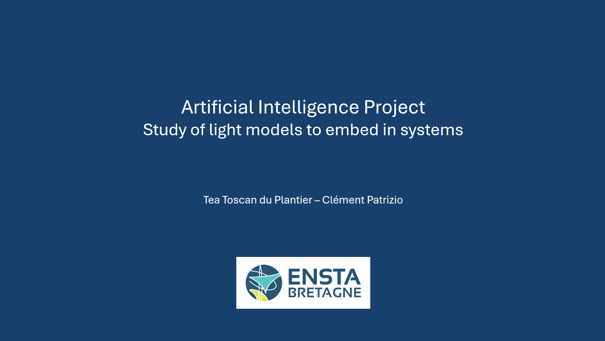

# AI_study
Academic project to study different machine learning models and optimization techniques

This project aims to compare different models and find a lightweight and efficient model to embed in a system. 

Lightweight means that the model should have a small number of parameters. 
Efficient means that it must achieve an accuracy of at least 90%.

A score will be calculated for the best model we find.
We have chosen to train our models on the CIFAR-10 dataset.

## Project Report

## Authors

- [@Clem-Pat](https://www.github.com/Clem-Pat)
- [@teatoscan](https://github.com/teatoscan)
